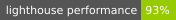
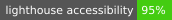
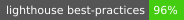
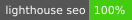

# vikum.dev — Portfolio

Personal portfolio site for [Vikum Samaranayake](https://vikum.dev), a Fullstack Engineer & Mobile Developer based in Singapore.

---

## CI/CD

[](https://github.com/vikum-samare/vikum-samare.github.io/actions/workflows/deploy-portfolio.yml)
[](https://github.com/vikum-samare/vikum-samare.github.io/actions/workflows/fetch-contributions.yml)

## Lighthouse






> To regenerate Lighthouse badges, run:
> ```bash
> bunx lighthouse-badges --url https://vikum.dev/ -o .github/badges --badge-style flat-square
> ```
> Then commit the updated SVGs in `.github/badges/`.

---

## Tech Stack

| Layer | Technology |
|---|---|
| Framework | Next.js 14 (Pages Router, static export) |
| Language | TypeScript |
| Styling | Tailwind CSS + CSS custom properties |
| Animation | Framer Motion |
| Package Manager | pnpm (monorepo) |
| Hosting | GitHub Pages |

## Project Structure

\`\`\`
apps/
  portfolio/        # Next.js app
    src/
      components/   # layout/, sections/, ui/
      config/       # content.en.ts, content.de.ts, content.nl.ts
      pages/        # index.tsx, de/, nl/
      types/        # content.ts
    public/         # Static assets, favicon, contribution data
scripts/
  fetch-contributions.mjs   # Fetches GitHub contribution data
  generate-mock-data.mjs
.github/
  workflows/
    deploy-portfolio.yml    # Build & deploy to GitHub Pages
    fetch-contributions.yml # Scheduled contribution data fetch
  badges/                   # Lighthouse SVG badges
\`\`\`

## Local Development

\`\`\`bash
# Install dependencies (from repo root)
pnpm install

# Start dev server
cd apps/portfolio
pnpm dev        # http://localhost:3000

# Type check
pnpm type-check

# Production build (static export → out/)
pnpm build
\`\`\`

## Content & Localisation

Content is managed in \`src/config/content.{en,de,nl}.ts\`. The site supports three languages at \`/\`, \`/de/\`, and \`/nl/\`. When adding new content fields, update all three language files and the shared type in \`src/types/content.ts\`.

## Links

- **Live site**: [vikum.dev](https://vikum.dev)
- **LinkedIn**: [vikum-samaranayake](https://www.linkedin.com/in/vikum-samaranayake/)
- **GitHub**: [@vikum-samare](https://github.com/vikum-samare)
